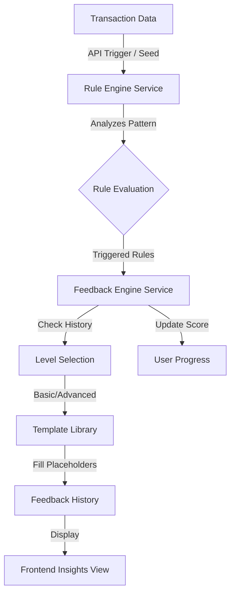

> **Last Updated:** 2026-02-05
# System Overview: Behavioral Insights & Rule Engine

This document provides a technical overview of how Spendlytic processes transaction data into actionable behavioral insights.

## Logic Flow

The system follows a deterministic pipeline from raw data to adaptive feedback:

---

## 1. Data Analysis (Rule Engine)

The `RuleEngineService` is responsible for detecting spending patterns. It is **deterministic** and **stateless** regarding feedback; it only reports what it finds in the data.

### Currently Implemented Rules:
| Rule | Condition | Threshold |
| :--- | :--- | :--- |
| **Category Overspend** | Category spending vs. Prev Week | > 25% Increase |
| **Weekly Spending Spike** | Total spending vs. Prev Week | > 20% Increase |
| **Frequent Small Purchases** | Transactions < $10 | 10+ occurrences |

> [!NOTE]
> Rules require a baseline. If no previous week data exists, spending-comparison rules (1 & 2) will not trigger.

---

## 2. Feedback Generation (Feedback Engine)

The `FeedbackEngineService` transforms raw rule triggers into human-readable advice.

### Adaptive Feedback Levels
The system adapts the "sophistication" of advice based on user behavior:
*   **Basic Level**: Used when a user is **Struggling** (same rule triggered 2+ consecutive weeks) or has mixed results. Focuses on simple, direct actions.
*   **Advanced Level**: Used when a user is **Improving** (rule not triggered for 2+ consecutive weeks). Focuses on optimization and deeper analysis.

### Template Matching
The engine uses the `FeedbackTemplateLibrary` to match a Rule ID and Level to a specialized template, filling placeholders like `${category}` or `${increase_percentage}` with real values.

---

## 3. Progress Tracking

Every evaluation updates the `user_progress` table with an **Improvement Score** (0-100).
*   **Gain Points**: Fewer rules triggered than previous week, or zero total triggers.
*   **Lose Points**: More rules triggered than previous week.

---

## 4. Current Trigger Mechanism

In the current development phase, insights are triggered via an API endpoint:
*   **Endpoint**: `GET /api/rule-engine/evaluate`
*   **Controller**: `RuleEngineController`
*   **Frontend**: Called on-demand or during dashboard/insights page initialization.

> [!IMPORTANT]
> **Observers & Events**: While the system is designed to support real-time observers (triggering on every `Transaction::created` event), this is currently disabled to prevent excessive feedback noise during manual data entry/CSV uploads. Evaluation is currently user-driven or triggered via the Insights dashboard.
